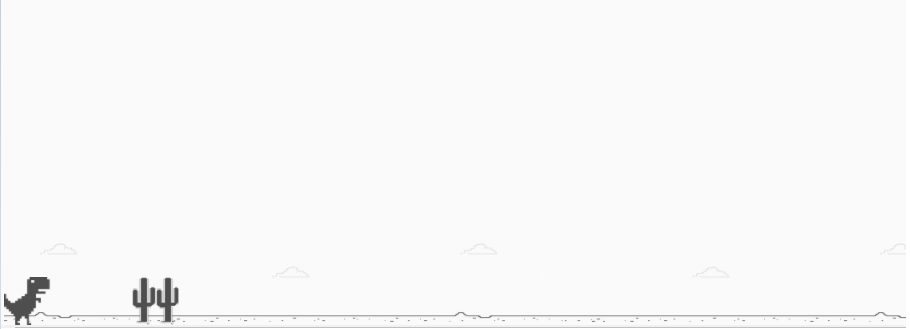

# **Recriando o famoso jogo do dinossauro sem internet**

## Projeto do Bootcamp JavaScript Game Developer na plataforma [Digital Innovation One](https://digitalinnovation.one/sign-up)

### Ministrado por: [Celso Henrique](https://www.linkedin.com/in/devfrontend/)  

### **Objetivo**  

Criar uma cópia do jogo do dinossauro do navegador Google Chrome utilizando as linguagens HTML5, CSS3 e JavaScript e abordando de maneira simples diversos conceitos introdutórios importantes para programação na web.

  

### **Conceitos Abordados**
- Tags básicas de HTML5. 
- Manipulação de eventos.
- Funções e manipulação de elementos HTML5 usando JavaScript.
- Estilização e animações básicas com CSS3.
  
### **Tecnologias Utilizadas**
- Visual Studio Code:
    - Live Server.
- Navegador.

### **Resultado Final**

